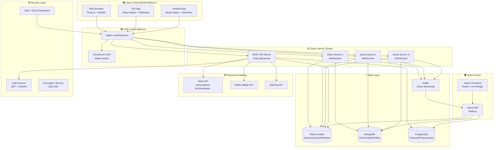
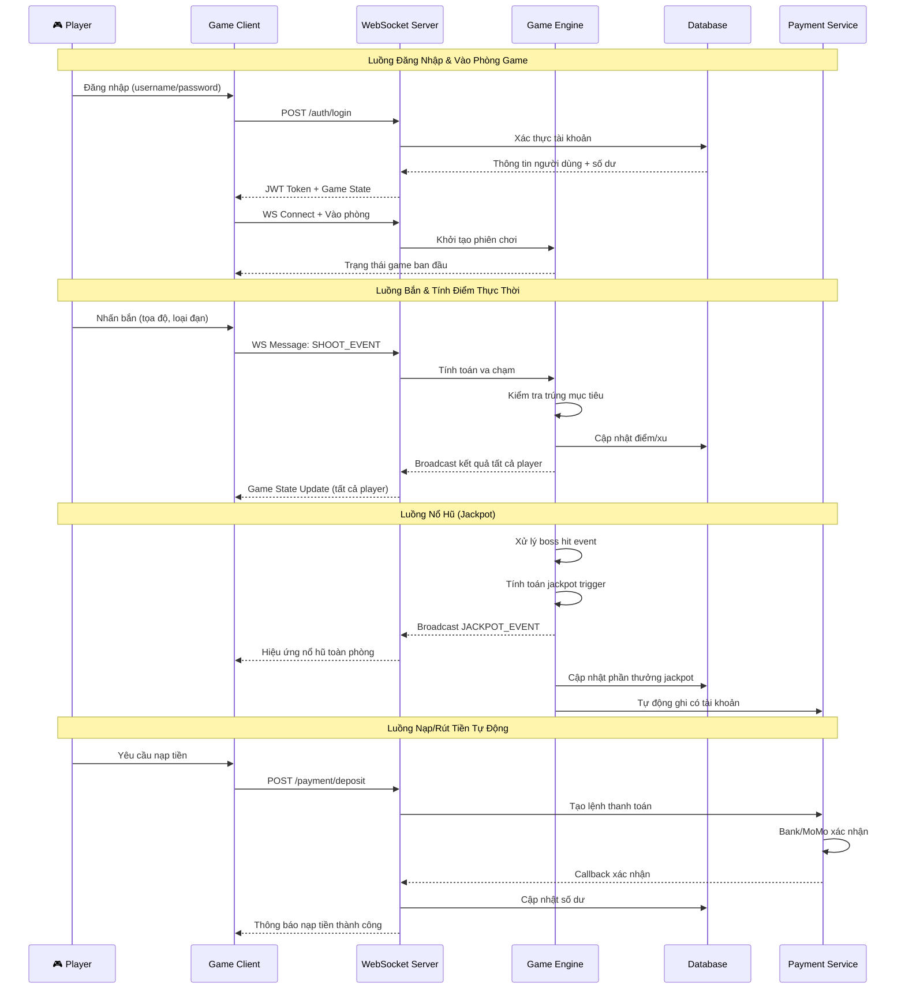
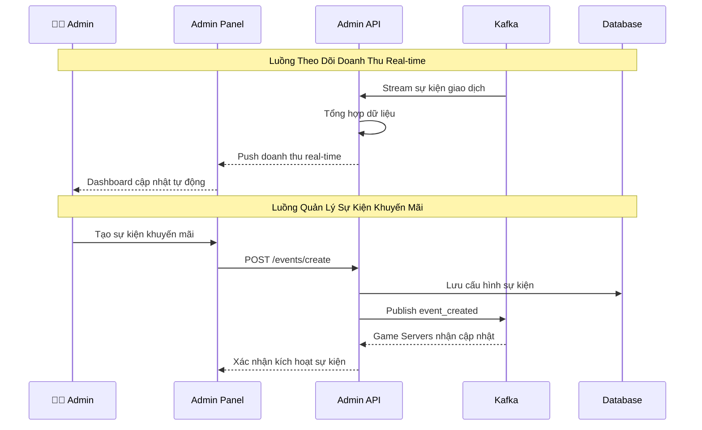
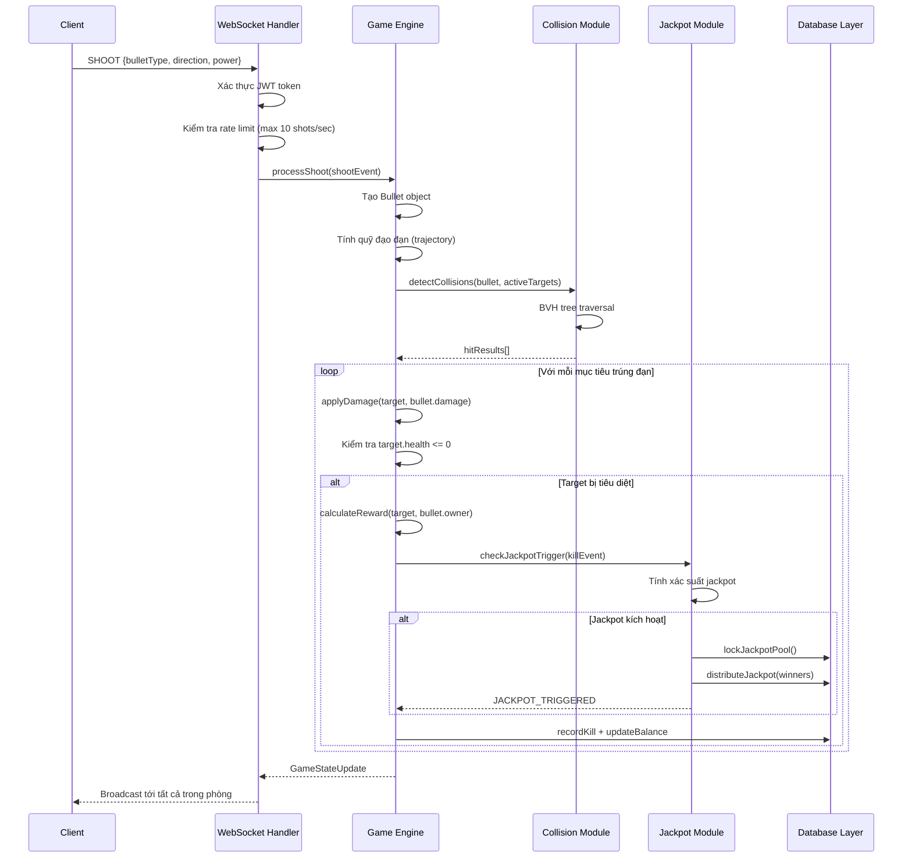

# Tài Liệu Thiết Kế: Airplane Shooter Webgame Online

## Overview

Airplane Shooter Webgame Online là một trò chơi bắn máy bay trực tuyến đa nền tảng (Web, iOS, Android) với đồ họa 3D sống động, tích hợp hệ thống nạp/rút tiền tự động qua ngân hàng và ví điện tử MoMo. Game áp dụng cơ chế "nổ hũ" (jackpot) với nhiều loại máy bay và boss đặc biệt, mang lại trải nghiệm giải trí kết hợp phần thưởng hấp dẫn cho người chơi.

Hệ thống bao gồm ba thành phần chính: **Game Client** (giao diện người chơi đa nền tảng), **Game Server** (xử lý logic và đồng bộ dữ liệu thời gian thực), và **Admin Panel** (quản trị toàn hệ thống, báo cáo doanh thu, quản lý sự kiện). Toàn bộ hệ thống được thiết kế với bảo mật cao, hỗ trợ đa ngôn ngữ và tối ưu hiệu năng cho hàng nghìn người dùng đồng thời.

## Architecture



## Components and Interfaces

### Game Client Module

**Mục đích**: Giao diện người chơi đa nền tảng với đồ họa 3D

**Giao diện**:
```pascal
INTERFACE GameClient
  METHOD initialize(config: ClientConfig): VOID
  METHOD connectToServer(token: String): ConnectionStatus
  METHOD renderFrame(deltaTime: Float): VOID
  METHOD handleInput(inputEvent: InputEvent): VOID
  METHOD updateGameState(state: GameState): VOID
  METHOD playEffect(effectType: EffectType, position: Vector3): VOID
  METHOD switchLanguage(lang: LanguageCode): VOID
END INTERFACE
```

**Trách nhiệm**:
- Render đồ họa 3D với Three.js/WebGL
- Quản lý input người chơi (chuột, cảm ứng, bàn phím)
- Đồng bộ trạng thái game qua WebSocket
- Hiển thị UI: điểm số, số dư, bảng xếp hạng, sự kiện
- Hỗ trợ đa ngôn ngữ (Tiếng Việt, Anh, Thái, ...)

### Game Engine Module

**Mục đích**: Xử lý logic game cốt lõi phía server

**Giao diện**:
```pascal
INTERFACE GameEngine
  METHOD createRoom(config: RoomConfig): Room
  METHOD joinRoom(playerId: String, roomId: String): JoinResult
  METHOD processShot(event: ShootEvent): ShotResult
  METHOD calculateCollision(bullet: Bullet, target: Target): CollisionResult
  METHOD triggerBoss(bossType: BossType): BossEvent
  METHOD checkJackpot(event: GameEvent): JackpotResult
  METHOD updateLeaderboard(playerId: String, score: Int): VOID
  METHOD applyPromotion(promo: Promotion, playerId: String): VOID
END INTERFACE
```

**Trách nhiệm**:
- Quản lý vòng lặp game (game loop) phía server
- Tính toán va chạm và sát thương
- Quản lý spawn máy bay và boss
- Xử lý cơ chế nổ hũ và jackpot
- Broadcast trạng thái game tới tất cả client

### Payment Service Module

**Mục đích**: Xử lý nạp/rút tiền tự động

**Giao diện**:
```pascal
INTERFACE PaymentService
  METHOD createDepositOrder(userId: String, amount: Decimal, method: PaymentMethod): DepositOrder
  METHOD createWithdrawOrder(userId: String, amount: Decimal, bankInfo: BankInfo): WithdrawOrder
  METHOD processCallback(provider: String, payload: CallbackPayload): ProcessResult
  METHOD getTransactionHistory(userId: String, filter: TransactionFilter): TransactionList
  METHOD checkBalance(userId: String): BalanceInfo
  METHOD autoReconcile(date: Date): ReconcileReport
END INTERFACE
```

**Trách nhiệm**:
- Tích hợp API ngân hàng (Vietcombank, Techcombank, MB Bank, ...)
- Tích hợp MoMo Wallet API và ZaloPay
- Xử lý callback xác nhận thanh toán
- Đối soát giao dịch tự động
- Mã hóa và bảo mật thông tin tài chính

### Admin Service Module

**Mục đích**: Quản trị toàn hệ thống, báo cáo doanh thu

**Giao diện**:
```pascal
INTERFACE AdminService
  METHOD getRevenueReport(filter: ReportFilter): RevenueReport
  METHOD getPlayerStats(playerId: String): PlayerStats
  METHOD managePromotion(action: AdminAction, promo: Promotion): ActionResult
  METHOD configureGame(settings: GameSettings): ConfigResult
  METHOD banPlayer(playerId: String, reason: String): ActionResult
  METHOD getSystemHealth(): SystemHealth
  METHOD exportReport(type: ReportType, format: ExportFormat): FileDownload
END INTERFACE
```

## Data Models

### Player (Người Chơi)

```pascal
STRUCTURE Player
  id: UUID
  username: String
  passwordHash: String
  email: String
  phone: String
  balance: Decimal
  frozenBalance: Decimal
  totalDeposit: Decimal
  totalWithdraw: Decimal
  totalWin: Decimal
  totalLose: Decimal
  level: Int
  experience: Int
  preferredLanguage: LanguageCode
  status: PlayerStatus              // ACTIVE | BANNED | SUSPENDED
  kycVerified: Boolean
  createdAt: DateTime
  lastLoginAt: DateTime
  deviceInfo: DeviceInfo[]
END STRUCTURE
```

### GameRoom (Phòng Game)

```pascal
STRUCTURE GameRoom
  id: UUID
  name: String
  type: RoomType                    // NORMAL | VIP | TOURNAMENT
  status: RoomStatus                // WAITING | PLAYING | CLOSED
  minBet: Decimal
  maxBet: Decimal
  maxPlayers: Int
  currentPlayers: Player[]
  jackpotPool: Decimal
  jackpotThreshold: Decimal
  activePromotions: Promotion[]
  gameSettings: GameSettings
  createdAt: DateTime
END STRUCTURE
```

### Airplane & Boss

```pascal
STRUCTURE Airplane
  id: UUID
  type: AirplaneType                // FIGHTER | BOMBER | SCOUT | STEALTH
  name: String
  health: Int
  maxHealth: Int
  speed: Float
  reward: RewardConfig
  spawnWeight: Float
  movementPattern: MovementPattern
  position: Vector3
  rotation: Quaternion
  isAlive: Boolean
END STRUCTURE

STRUCTURE Boss
  id: UUID
  type: BossType                    // MEGA_BOSS | MINI_BOSS | JACKPOT_BOSS
  name: String
  health: Int
  maxHealth: Int
  phases: BossPhase[]
  jackpotMultiplier: Float
  specialAbilities: Ability[]
  triggerCondition: TriggerCondition
  reward: JackpotReward
END STRUCTURE
```

### Transaction (Giao Dịch)

```pascal
STRUCTURE Transaction
  id: UUID
  userId: UUID
  type: TransactionType             // DEPOSIT | WITHDRAW | WIN | LOSE | BONUS | REFUND
  amount: Decimal
  currency: Currency
  status: TransactionStatus         // PENDING | SUCCESS | FAILED | CANCELLED
  paymentMethod: PaymentMethod      // BANK_TRANSFER | MOMO | ZALOPAY | GAME_WIN
  providerOrderId: String
  providerRef: String
  bankInfo: BankInfo
  note: String
  ipAddress: String
  createdAt: DateTime
  updatedAt: DateTime
  confirmedAt: DateTime
END STRUCTURE
```

### Promotion (Sự Kiện Khuyến Mãi)

```pascal
STRUCTURE Promotion
  id: UUID
  name: String
  description: String
  type: PromotionType               // DEPOSIT_BONUS | CASHBACK | FREE_BULLETS | DOUBLE_XP | SPECIAL_BOSS
  status: PromotionStatus           // DRAFT | ACTIVE | EXPIRED | PAUSED
  startTime: DateTime
  endTime: DateTime
  conditions: PromotionCondition[]
  rewards: PromotionReward[]
  targetRooms: UUID[]
  targetPlayers: PlayerFilter
  maxParticipants: Int
  currentParticipants: Int
  createdBy: UUID
  createdAt: DateTime
END STRUCTURE
```

## Correctness Properties

*Một property là đặc tính hoặc hành vi phải đúng trong mọi lần thực thi hợp lệ của hệ thống — về cơ bản là một phát biểu hình thức về điều hệ thống phải làm. Properties là cầu nối giữa đặc tả dạng văn bản dễ đọc và đảm bảo tính đúng đắn có thể kiểm chứng tự động.*

### Property 1: Bảo toàn tổng số dư hệ thống

*Với mọi* tập hợp số dư ban đầu hợp lệ (≥ 0) và chuỗi sự kiện game bất kỳ, tổng số dư của toàn hệ thống trước và sau khi xử lý phải bằng nhau — tiền thưởng trả cho người thắng phải được bù đắp bởi tiền thu từ người thua và phí hệ thống.

```pascal
FOR ALL (initialBalances: Decimal[], gameEvents: GameEvent[])
WHERE tất cả balance >= 0
HOLDS:
  totalBefore ← sum(initialBalances)
  processEvents(gameEvents)
  totalAfter ← sum(getAllBalances())
  ASSERT totalBefore = totalAfter
```

**Validates: Requirement 15.1**

### Property 2: Collision detection deterministic

*Với mọi* cặp (viên đạn, mục tiêu) bất kỳ, hàm phát hiện va chạm luôn trả về kết quả giống nhau khi được gọi với cùng đầu vào — không có yếu tố ngẫu nhiên ảnh hưởng đến kết quả va chạm.

```pascal
FOR ALL (bullet: Bullet, target: Target)
HOLDS:
  hit1 ← detectCollision(bullet, target)
  hit2 ← detectCollision(bullet, target)
  ASSERT hit1.result = hit2.result
```

**Validates: Requirement 4.2**

### Property 3: Jackpot pool không bao giờ âm

*Với mọi* chuỗi sự kiện tiêu diệt mục tiêu bất kỳ và quỹ jackpot ban đầu hợp lệ, quỹ jackpot của phòng phải luôn ≥ mức tối thiểu cấu hình (minJackpotPool) sau bất kỳ sự kiện nào.

```pascal
FOR ALL (events: KillEvent[], initialPool: Decimal)
WHERE initialPool >= minJackpotPool
HOLDS:
  FOR EACH event IN events DO
    processKillEvent(event)
  END FOR
  ASSERT room.jackpotPool >= minJackpotPool
```

**Validates: Requirement 6.2**

### Property 4: Payment callback idempotency

*Với mọi* callback thanh toán bất kỳ, xử lý lại callback có cùng orderId không được cộng thêm tiền lần thứ hai — tổng thay đổi số dư phải bằng nhau dù callback được gọi một hay nhiều lần.

```pascal
FOR ALL (callback: PaymentCallback)
HOLDS:
  result1 ← processCallback(callback)
  result2 ← processCallback(callback)  // Gọi lại callback cùng orderId
  ASSERT result1.balanceChange = result2.balanceChange  // Không cộng tiền 2 lần
```

**Validates: Requirement 8.5**

### Property 5: Jackpot phân phối đúng người thắng

*Với mọi* sự kiện tiêu diệt boss (MINI_BOSS, MEGA_BOSS, JACKPOT_BOSS) và phòng game bất kỳ, nếu jackpot kích hoạt thì danh sách người thắng phải là tập con của người chơi đang có mặt trong phòng, và tổng phần trăm chia phần thưởng phải bằng đúng 100%.

```pascal
FOR ALL (killEvent: KillEvent, room: GameRoom)
WHERE killEvent.target.type IN [MINI_BOSS, MEGA_BOSS, JACKPOT_BOSS]
HOLDS:
  result ← checkJackpotTrigger(killEvent, room)
  IF result.triggered THEN
    ASSERT result.winners SUBSET_OF room.currentPlayers
    ASSERT sum(result.winners.sharePercentage) = 1.0
  END IF
```

**Validates: Requirement 6.3**

### Property 6: Số dư người chơi không bao giờ âm

*Với mọi* chuỗi sự kiện bắn đạn và giao dịch tài chính bất kỳ, số dư khả dụng của người chơi (balance - frozenBalance) không bao giờ được phép trở thành số âm.

*Với mọi* người chơi p và chuỗi sự kiện e[], sau khi xử lý: p.balance - p.frozenBalance ≥ 0

**Validates: Requirements 4.3, 9.2**

### Property 7: Mã hóa dữ liệu nhạy cảm - round trip

*Với mọi* chuỗi dữ liệu nhạy cảm bất kỳ (số tài khoản ngân hàng, số điện thoại), việc mã hóa AES-256-GCM rồi giải mã phải trả về đúng giá trị gốc — không có mất mát hay biến đổi dữ liệu.

*Với mọi* plaintext hợp lệ: decrypt(encrypt(plaintext, key), key) = plaintext

**Validates: Requirement 14.3**

### Property 8: Xác thực JWT - từ chối token không hợp lệ

*Với mọi* yêu cầu HTTP đến các endpoint được bảo vệ, nếu request không kèm JWT hợp lệ (thiếu token, chữ ký sai, hoặc hết hạn) thì hệ thống phải trả về mã lỗi 401 và không thực hiện hành động nào.

*Với mọi* request r không có valid JWT: response(r).status = 401 AND sideEffects(r) = ∅

**Validates: Requirement 14.1**

### Property 9: Khóa tài khoản sau đăng nhập sai nhiều lần

*Với mọi* tài khoản bất kỳ, sau đúng 5 lần đăng nhập sai liên tiếp, mọi lần thử đăng nhập tiếp theo trong vòng 15 phút (dù đúng hay sai thông tin) đều phải bị từ chối.

*Với mọi* tài khoản a: sau failedAttempts(a) = 5, trong 15 phút tiếp theo: login(a, anyCredentials).success = FALSE

**Validates: Requirement 1.4**

## Error Handling

### Phân Loại Lỗi

| Loại Lỗi | Mã | Xử Lý |
|-----------|-----|--------|
| Xác thực thất bại | AUTH_001 | Trả về 401, ghi log |
| Token hết hạn | AUTH_002 | Yêu cầu refresh token |
| Không đủ số dư | GAME_001 | Thông báo, không xử lý shot |
| Rate limit vượt | SYS_001 | Trả về 429, backoff exponential |
| Kết nối DB lỗi | DB_001 | Retry 3 lần, fallback cache |
| Payment timeout | PAY_001 | Hủy đơn hàng, hoàn tiền nếu đã trừ |
| Callback giả mạo | SEC_001 | Từ chối, cảnh báo admin, IP block |
| WebSocket ngắt | WS_001 | Auto-reconnect, khôi phục trạng thái |

### Xử Lý Ngắt Kết Nối

```pascal
PROCEDURE handlePlayerDisconnect(playerId: UUID, roomId: UUID)
  INPUT: playerId, roomId - người chơi mất kết nối
  OUTPUT: VOID

  SEQUENCE
    playerSession ← getPlayerSession(playerId)
    playerSession.status ← DISCONNECTED
    playerSession.disconnectedAt ← currentTime()

    savePlayerGameState(playerId, roomId)
    scheduleAutoLeave(playerId, roomId, delay: 30_SECONDS)

    broadcastToRoom(roomId, PlayerEvent {
      type: PLAYER_DISCONNECTED,
      playerId: playerId,
      timeout: 30
    })
  END SEQUENCE
END PROCEDURE
```

## Testing Strategy

### Unit Testing Approach

- **Game Engine Logic**: Kiểm thử collision detection với các trường hợp biên (bullet ở góc, multiple hits)
- **Jackpot Algorithm**: Kiểm thử phân phối xác suất thống kê (1 triệu simulation)
- **Payment Processing**: Mock API ngân hàng, kiểm thử idempotency
- **Authentication**: Kiểm thử brute-force protection, token expiry, refresh logic

### Property-Based Testing Approach

**Thư viện**: fast-check (TypeScript)

Các property chính cần kiểm thử:
- Tổng số dư bảo toàn sau game events
- Tính idempotent của payment callbacks
- Jackpot pool không bao giờ âm
- Collision detection deterministic

### Integration Testing Approach

- **End-to-End Payment Flow**: Nạp → Chơi → Thắng → Rút với mock bank API
- **Multi-Player Sync**: 50 player đồng thời trong 1 phòng, kiểm tra tính nhất quán
- **WebSocket Stress Test**: Flood 10,000 messages/giây, kiểm tra không mất tin nhắn
- **Jackpot Concurrency**: Nhiều boss cùng chết, kiểm tra chỉ 1 jackpot được kích hoạt

## Tổng Quan

Airplane Shooter Webgame Online là một trò chơi bắn máy bay trực tuyến đa nền tảng (Web, iOS, Android) với đồ họa 3D sống động, tích hợp hệ thống nạp/rút tiền tự động qua ngân hàng và ví điện tử MoMo. Game áp dụng cơ chế "nổ hũ" (jackpot) với nhiều loại máy bay và boss đặc biệt, mang lại trải nghiệm giải trí kết hợp phần thưởng hấp dẫn cho người chơi.

Hệ thống bao gồm ba thành phần chính: **Game Client** (giao diện người chơi đa nền tảng), **Game Server** (xử lý logic và đồng bộ dữ liệu thời gian thực), và **Admin Panel** (quản trị toàn hệ thống, báo cáo doanh thu, quản lý sự kiện). Toàn bộ hệ thống được thiết kế với bảo mật cao, hỗ trợ đa ngôn ngữ và tối ưu hiệu năng cho hàng nghìn người dùng đồng thời.

---

## Phần 1: High-Level Design

### 1.1 Kiến Trúc Tổng Thể


### 1.2 Sơ Đồ Luồng Dữ Liệu Chính



### 1.3 Sơ Đồ Luồng Admin & Báo Cáo



### 1.4 Các Thành Phần và Giao Diện

#### 1.4.1 Game Client Module

**Mục đích**: Giao diện người chơi đa nền tảng với đồ họa 3D

**Giao diện**:
```pascal
INTERFACE GameClient
  METHOD initialize(config: ClientConfig): VOID
  METHOD connectToServer(token: String): ConnectionStatus
  METHOD renderFrame(deltaTime: Float): VOID
  METHOD handleInput(inputEvent: InputEvent): VOID
  METHOD updateGameState(state: GameState): VOID
  METHOD playEffect(effectType: EffectType, position: Vector3): VOID
  METHOD switchLanguage(lang: LanguageCode): VOID
END INTERFACE
```

**Trách nhiệm**:
- Render đồ họa 3D với Three.js/WebGL
- Quản lý input người chơi (chuột, cảm ứng, bàn phím)
- Đồng bộ trạng thái game qua WebSocket
- Hiển thị UI: điểm số, số dư, bảng xếp hạng, sự kiện
- Hỗ trợ đa ngôn ngữ (Tiếng Việt, Anh, Thái, ...)

#### 1.4.2 Game Engine Module

**Mục đích**: Xử lý logic game cốt lõi phía server

**Giao diện**:
```pascal
INTERFACE GameEngine
  METHOD createRoom(config: RoomConfig): Room
  METHOD joinRoom(playerId: String, roomId: String): JoinResult
  METHOD processShot(event: ShootEvent): ShotResult
  METHOD calculateCollision(bullet: Bullet, target: Target): CollisionResult
  METHOD triggerBoss(bossType: BossType): BossEvent
  METHOD checkJackpot(event: GameEvent): JackpotResult
  METHOD updateLeaderboard(playerId: String, score: Int): VOID
  METHOD applyPromotion(promo: Promotion, playerId: String): VOID
END INTERFACE
```

**Trách nhiệm**:
- Quản lý vòng lặp game (game loop) phía server
- Tính toán va chạm và sát thương
- Quản lý spawn máy bay và boss
- Xử lý cơ chế nổ hũ và jackpot
- Broadcast trạng thái game tới tất cả client

#### 1.4.3 Payment Service Module

**Mục đích**: Xử lý nạp/rút tiền tự động

**Giao diện**:
```pascal
INTERFACE PaymentService
  METHOD createDepositOrder(userId: String, amount: Decimal, method: PaymentMethod): DepositOrder
  METHOD createWithdrawOrder(userId: String, amount: Decimal, bankInfo: BankInfo): WithdrawOrder
  METHOD processCallback(provider: String, payload: CallbackPayload): ProcessResult
  METHOD getTransactionHistory(userId: String, filter: TransactionFilter): TransactionList
  METHOD checkBalance(userId: String): BalanceInfo
  METHOD autoReconcile(date: Date): ReconcileReport
END INTERFACE
```

**Trách nhiệm**:
- Tích hợp API ngân hàng (Vietcombank, Techcombank, MB Bank, ...)
- Tích hợp MoMo Wallet API và ZaloPay
- Xử lý callback xác nhận thanh toán
- Đối soát giao dịch tự động
- Mã hóa và bảo mật thông tin tài chính

#### 1.4.4 Admin Panel Module

**Mục đích**: Quản trị toàn hệ thống, báo cáo doanh thu

**Giao diện**:
```pascal
INTERFACE AdminService
  METHOD getRevenueReport(filter: ReportFilter): RevenueReport
  METHOD getPlayerStats(playerId: String): PlayerStats
  METHOD managePromotion(action: AdminAction, promo: Promotion): ActionResult
  METHOD configureGame(settings: GameSettings): ConfigResult
  METHOD banPlayer(playerId: String, reason: String): ActionResult
  METHOD getSystemHealth(): SystemHealth
  METHOD exportReport(type: ReportType, format: ExportFormat): FileDownload
END INTERFACE
```

### 1.5 Mô Hình Dữ Liệu

#### 1.5.1 Người Chơi (Player)

```pascal
STRUCTURE Player
  id: UUID                          // Định danh duy nhất
  username: String                  // Tên đăng nhập (unique)
  passwordHash: String              // Mật khẩu đã hash bcrypt
  email: String                     // Email xác thực
  phone: String                     // Số điện thoại
  balance: Decimal                  // Số dư hiện tại (VNĐ)
  frozenBalance: Decimal            // Số dư đang xử lý giao dịch
  totalDeposit: Decimal             // Tổng nạp tích lũy
  totalWithdraw: Decimal            // Tổng rút tích lũy
  totalWin: Decimal                 // Tổng thắng tích lũy
  totalLose: Decimal                // Tổng thua tích lũy
  level: Int                        // Cấp độ người chơi
  experience: Int                   // Điểm kinh nghiệm
  preferredLanguage: LanguageCode   // Ngôn ngữ ưa thích
  status: PlayerStatus              // ACTIVE | BANNED | SUSPENDED
  kycVerified: Boolean              // Xác minh danh tính
  createdAt: DateTime
  lastLoginAt: DateTime
  deviceInfo: DeviceInfo[]          // Danh sách thiết bị
END STRUCTURE

STRUCTURE DeviceInfo
  deviceId: String
  platform: Platform                // WEB | IOS | ANDROID
  deviceToken: String               // Push notification token
  lastActiveAt: DateTime
END STRUCTURE
```

#### 1.5.2 Phòng Game (GameRoom)

```pascal
STRUCTURE GameRoom
  id: UUID
  name: String
  type: RoomType                    // NORMAL | VIP | TOURNAMENT
  status: RoomStatus                // WAITING | PLAYING | CLOSED
  minBet: Decimal                   // Cược tối thiểu
  maxBet: Decimal                   // Cược tối đa
  maxPlayers: Int                   // Số người chơi tối đa
  currentPlayers: Player[]          // Danh sách người chơi hiện tại
  jackpotPool: Decimal              // Quỹ jackpot hiện tại
  jackpotThreshold: Decimal         // Ngưỡng kích hoạt jackpot
  activePromotions: Promotion[]     // Sự kiện đang áp dụng
  gameSettings: GameSettings
  createdAt: DateTime
END STRUCTURE
```

#### 1.5.3 Máy Bay & Boss

```pascal
STRUCTURE Airplane
  id: UUID
  type: AirplaneType                // FIGHTER | BOMBER | SCOUT | STEALTH
  name: String
  health: Int                       // Máu hiện tại
  maxHealth: Int                    // Máu tối đa
  speed: Float                      // Tốc độ di chuyển
  reward: RewardConfig              // Phần thưởng khi tiêu diệt
  spawnWeight: Float                // Tỷ lệ xuất hiện
  movementPattern: MovementPattern  // Kiểu di chuyển
  position: Vector3                 // Vị trí 3D
  rotation: Quaternion              // Hướng xoay
  isAlive: Boolean
END STRUCTURE

STRUCTURE Boss
  id: UUID
  type: BossType                    // MEGA_BOSS | MINI_BOSS | JACKPOT_BOSS
  name: String
  health: Int
  maxHealth: Int
  phases: BossPhase[]               // Các giai đoạn chiến đấu
  jackpotMultiplier: Float          // Hệ số nhân jackpot
  specialAbilities: Ability[]       // Kỹ năng đặc biệt
  triggerCondition: TriggerCondition
  reward: JackpotReward
END STRUCTURE

STRUCTURE JackpotReward
  baseAmount: Decimal               // Phần thưởng cơ bản
  multiplier: Float                 // Hệ số nhân theo boss phase
  bonusItems: Item[]                // Vật phẩm thưởng thêm
  broadcastMessage: String          // Thông báo toàn server
END STRUCTURE
```

#### 1.5.4 Giao Dịch (Transaction)

```pascal
STRUCTURE Transaction
  id: UUID
  userId: UUID
  type: TransactionType             // DEPOSIT | WITHDRAW | WIN | LOSE | BONUS | REFUND
  amount: Decimal
  currency: Currency                // VND
  status: TransactionStatus         // PENDING | SUCCESS | FAILED | CANCELLED
  paymentMethod: PaymentMethod      // BANK_TRANSFER | MOMO | ZALOPAY | GAME_WIN
  providerOrderId: String           // Mã đơn hàng từ provider
  providerRef: String               // Mã tham chiếu từ bank/ví
  bankInfo: BankInfo                // Thông tin tài khoản ngân hàng
  note: String
  ipAddress: String
  createdAt: DateTime
  updatedAt: DateTime
  confirmedAt: DateTime
END STRUCTURE

STRUCTURE BankInfo
  bankCode: String                  // VCB | TCB | MBB | ...
  accountNumber: String             // Số tài khoản (mã hóa AES-256)
  accountName: String               // Tên chủ tài khoản
  branchName: String                // Chi nhánh
END STRUCTURE
```

#### 1.5.5 Sự Kiện Khuyến Mãi (Promotion)

```pascal
STRUCTURE Promotion
  id: UUID
  name: String
  description: String
  type: PromotionType               // DEPOSIT_BONUS | CASHBACK | FREE_BULLETS | DOUBLE_XP | SPECIAL_BOSS
  status: PromotionStatus           // DRAFT | ACTIVE | EXPIRED | PAUSED
  startTime: DateTime
  endTime: DateTime
  conditions: PromotionCondition[]  // Điều kiện áp dụng
  rewards: PromotionReward[]        // Phần thưởng
  targetRooms: UUID[]               // Phòng áp dụng
  targetPlayers: PlayerFilter       // Lọc đối tượng người chơi
  maxParticipants: Int
  currentParticipants: Int
  createdBy: UUID                   // Admin tạo
  createdAt: DateTime
END STRUCTURE
```

---

## Phần 2: Low-Level Design

### 2.1 Sơ Đồ Tuần Tự Chi Tiết



### 2.2 Thuật Toán Cốt Lõi

#### 2.2.1 Vòng Lặp Game Server (Server Game Loop)

```pascal
PROCEDURE runGameLoop(room: GameRoom)
  INPUT: room - phòng game đang hoạt động
  OUTPUT: VOID (chạy liên tục cho tới khi phòng đóng)

  CONSTANT TARGET_FPS ← 30
  CONSTANT TICK_INTERVAL ← 1000 / TARGET_FPS  // ~33ms

  SEQUENCE
    lastTickTime ← getCurrentTime()

    WHILE room.status = PLAYING DO
      currentTime ← getCurrentTime()
      deltaTime ← currentTime - lastTickTime

      IF deltaTime >= TICK_INTERVAL THEN
        // Cập nhật vật lý và vị trí
        updatePhysics(room, deltaTime)

        // Xử lý tất cả sự kiện đến trong tick này
        pendingEvents ← room.eventQueue.drainAll()
        FOR EACH event IN pendingEvents DO
          processEvent(room, event)
        END FOR

        // Spawn máy bay mới theo tỷ lệ
        spawnAirplanes(room, deltaTime)

        // Kiểm tra kết thúc sự kiện khuyến mãi
        checkPromotionExpiry(room)

        // Tạo snapshot trạng thái để gửi client
        stateSnapshot ← buildStateSnapshot(room)
        broadcastToRoom(room.id, stateSnapshot)

        lastTickTime ← currentTime
      END IF

      sleep(1)  // Nhường CPU tránh busy-wait
    END WHILE
  END SEQUENCE
END PROCEDURE
```

#### 2.2.2 Thuật Toán Phát Hiện Va Chạm (Collision Detection)

```pascal
PROCEDURE detectCollisions(bullet: Bullet, targets: Target[])
  INPUT: bullet - viên đạn đang bay, targets - danh sách mục tiêu
  OUTPUT: hitResults[] - danh sách kết quả trúng đạn

  SEQUENCE
    hitResults ← []

    // Bước 1: Broad phase - AABB kiểm tra nhanh
    candidateTargets ← []
    FOR EACH target IN targets DO
      IF intersectsAABB(bullet.boundingBox, target.boundingBox) THEN
        candidateTargets.add(target)
      END IF
    END FOR

    // Bước 2: Narrow phase - kiểm tra chi tiết hơn
    FOR EACH target IN candidateTargets DO
      IF target.isAlive = FALSE THEN
        CONTINUE
      END IF

      // Tính giao điểm ray-sphere
      intersection ← rayIntersectsSphere(
        ray: bullet.trajectory,
        sphere: target.collisionSphere
      )

      IF intersection.hit = TRUE THEN
        hitResult ← HitResult {
          targetId: target.id,
          hitPoint: intersection.point,
          penetrationDepth: intersection.depth,
          damage: calculateDamage(bullet, target, intersection)
        }
        hitResults.add(hitResult)
      END IF
    END FOR

    // Sắp xếp theo khoảng cách (gần nhất trước)
    SORT hitResults BY distanceFromBulletOrigin ASCENDING

    RETURN hitResults
  END SEQUENCE
END PROCEDURE

PROCEDURE rayIntersectsSphere(ray: Ray, sphere: Sphere)
  INPUT: ray - quỹ đạo đạn, sphere - vùng va chạm hình cầu
  OUTPUT: IntersectionResult

  SEQUENCE
    // Vector từ gốc ray tới tâm sphere
    oc ← ray.origin - sphere.center

    a ← dotProduct(ray.direction, ray.direction)
    b ← 2.0 * dotProduct(oc, ray.direction)
    c ← dotProduct(oc, oc) - sphere.radius * sphere.radius

    discriminant ← b * b - 4 * a * c

    IF discriminant < 0 THEN
      RETURN IntersectionResult { hit: FALSE }
    END IF

    t ← (-b - sqrt(discriminant)) / (2.0 * a)

    IF t < 0 THEN
      RETURN IntersectionResult { hit: FALSE }
    END IF

    hitPoint ← ray.origin + t * ray.direction
    RETURN IntersectionResult {
      hit: TRUE,
      point: hitPoint,
      depth: sphere.radius - distance(hitPoint, sphere.center)
    }
  END SEQUENCE
END PROCEDURE
```

#### 2.2.3 Thuật Toán Spawn Máy Bay (Airplane Spawning)

```pascal
PROCEDURE spawnAirplanes(room: GameRoom, deltaTime: Float)
  INPUT: room - phòng game, deltaTime - thời gian từ tick trước
  OUTPUT: VOID

  SEQUENCE
    room.spawnTimer ← room.spawnTimer + deltaTime

    IF room.spawnTimer < room.spawnInterval THEN
      RETURN  // Chưa đến lúc spawn
    END IF

    room.spawnTimer ← 0

    // Kiểm tra số lượng máy bay tối đa
    IF room.activeAirplanes.count() >= room.settings.maxAirplanes THEN
      RETURN
    END IF

    // Tính số lượng cần spawn dựa trên số người chơi
    spawnCount ← calculateSpawnCount(room.currentPlayers.count())

    FOR i FROM 1 TO spawnCount DO
      // Chọn loại máy bay theo trọng số (weighted random)
      airplaneType ← weightedRandomSelect(AIRPLANE_SPAWN_TABLE)

      // Kiểm tra điều kiện đặc biệt (boss spawn)
      IF shouldSpawnBoss(room) THEN
        airplaneType ← selectBossType(room)
      END IF

      // Tạo vị trí spawn ngẫu nhiên ngoài màn hình
      spawnPosition ← generateSpawnPosition(room.bounds)
      targetPosition ← generateTargetPosition(room.bounds)

      newAirplane ← createAirplane(
        type: airplaneType,
        position: spawnPosition,
        target: targetPosition,
        promotionMultiplier: room.activePromotions
      )

      room.activeAirplanes.add(newAirplane)
    END FOR
  END SEQUENCE
END PROCEDURE

PROCEDURE weightedRandomSelect(table: SpawnTableEntry[])
  INPUT: table - bảng spawn với trọng số
  OUTPUT: AirplaneType - loại máy bay được chọn

  SEQUENCE
    totalWeight ← 0
    FOR EACH entry IN table DO
      totalWeight ← totalWeight + entry.weight
    END FOR

    randomValue ← random(0, totalWeight)
    cumulativeWeight ← 0

    FOR EACH entry IN table DO
      cumulativeWeight ← cumulativeWeight + entry.weight
      IF randomValue <= cumulativeWeight THEN
        RETURN entry.airplaneType
      END IF
    END FOR

    RETURN table[0].airplaneType  // Fallback
  END SEQUENCE
END PROCEDURE
```

#### 2.2.4 Thuật Toán Cơ Chế Nổ Hũ (Jackpot System)

```pascal
PROCEDURE checkJackpotTrigger(killEvent: KillEvent, room: GameRoom)
  INPUT: killEvent - sự kiện tiêu diệt mục tiêu, room - phòng game
  OUTPUT: JackpotResult

  SEQUENCE
    // Chỉ boss mới kích hoạt jackpot
    IF killEvent.target.type NOT IN [MINI_BOSS, MEGA_BOSS, JACKPOT_BOSS] THEN
      RETURN JackpotResult { triggered: FALSE }
    END IF

    boss ← killEvent.target

    // Tính xác suất jackpot dựa trên loại boss và quỹ tích lũy
    baseProbability ← BOSS_JACKPOT_TABLE[boss.type].baseProbability
    poolMultiplier ← calculatePoolMultiplier(room.jackpotPool)
    finalProbability ← baseProbability * poolMultiplier

    // Áp dụng promotion multiplier nếu có
    IF room.hasActivePromotion(JACKPOT_BOOST) THEN
      finalProbability ← finalProbability * room.getPromotionMultiplier(JACKPOT_BOOST)
    END IF

    // Giới hạn xác suất tối đa 100%
    finalProbability ← min(finalProbability, 1.0)

    randomRoll ← random(0.0, 1.0)

    IF randomRoll <= finalProbability THEN
      // Jackpot kích hoạt!
      winners ← determineJackpotWinners(killEvent, room)
      reward ← calculateJackpotReward(boss, room.jackpotPool)

      RETURN JackpotResult {
        triggered: TRUE,
        winners: winners,
        reward: reward,
        bossType: boss.type
      }
    END IF

    // Không jackpot - cộng vào quỹ tích lũy
    contribution ← calculatePoolContribution(killEvent)
    room.jackpotPool ← room.jackpotPool + contribution

    RETURN JackpotResult { triggered: FALSE, poolIncrease: contribution }
  END SEQUENCE
END PROCEDURE

PROCEDURE distributeJackpotReward(result: JackpotResult, room: GameRoom)
  INPUT: result - kết quả jackpot, room - phòng game
  OUTPUT: VOID

  SEQUENCE
    // Khóa quỹ để tránh race condition
    acquireLock(room.jackpotPool.lockKey)

    TRY
      totalReward ← result.reward.baseAmount + room.jackpotPool

      FOR EACH winner IN result.winners DO
        winnerShare ← totalReward * winner.sharePercentage
        updatePlayerBalance(winner.playerId, winnerShare, JACKPOT_WIN)
        sendNotification(winner.playerId, "Chúc mừng! Bạn đã trúng jackpot " + winnerShare)
      END FOR

      // Reset quỹ jackpot về mức tối thiểu
      room.jackpotPool ← room.settings.minJackpotPool

      // Broadcast thông báo toàn phòng
      broadcastJackpotEvent(room, result)

    FINALLY
      releaseLock(room.jackpotPool.lockKey)
    END TRY
  END SEQUENCE
END PROCEDURE
```

### 2.3 Chữ Ký Hàm (Function Signatures) với Đặc Tả Chính Thức

#### 2.3.1 Xác Thực & Phiên Làm Việc

```pascal
PROCEDURE authenticatePlayer(credentials: LoginCredentials)
  INPUT: credentials = {username: String, password: String, deviceInfo: DeviceInfo}
  OUTPUT: AuthResult = Success(token: JWT, player: PlayerProfile) | Error(code: ErrorCode, message: String)

  PRECONDITIONS:
    - credentials.username không rỗng và có độ dài 4-32 ký tự
    - credentials.password không rỗng và có độ dài >= 8 ký tự
    - deviceInfo.platform thuộc [WEB, IOS, ANDROID]

  POSTCONDITIONS:
    - Nếu Success: token hợp lệ trong 24 giờ, player.status = ACTIVE
    - Nếu Error: không cập nhật bất kỳ trạng thái nào trong DB
    - Ghi log đăng nhập bất kể thành công hay thất bại
    - Sau 5 lần thất bại liên tiếp: tài khoản tạm khóa 15 phút

PROCEDURE refreshToken(oldToken: JWT)
  INPUT: oldToken - JWT token còn hạn hoặc vừa hết hạn (trong 5 phút)
  OUTPUT: AuthResult = Success(newToken: JWT) | Error(code: ErrorCode)

  PRECONDITIONS:
    - oldToken có chữ ký hợp lệ
    - oldToken chưa bị thu hồi (revoked)
    - oldToken hết hạn không quá 5 phút

  POSTCONDITIONS:
    - oldToken bị đánh dấu revoked
    - newToken có thời hạn 24 giờ mới từ thời điểm cấp
```

#### 2.3.2 Xử Lý Bắn Đạn

```pascal
PROCEDURE processShootEvent(event: ShootEvent, context: GameContext)
  INPUT:
    event = {
      playerId: UUID,
      bulletType: BulletType,         // NORMAL | SPECIAL | LASER | BOMB
      direction: Vector3,              // Hướng bắn đơn vị
      power: Float,                    // Sức mạnh [0.1, 1.0]
      timestamp: Long                  // Unix timestamp milliseconds
    }
    context = {
      room: GameRoom,
      playerState: PlayerState
    }
  OUTPUT: ShootResult = {
    bulletId: UUID,
    hitResults: HitResult[],
    rewardEarned: Decimal,
    newBalance: Decimal,
    jackpotResult: JackpotResult | NULL
  }

  PRECONDITIONS:
    - event.playerId là thành viên hợp lệ trong context.room
    - event.direction là vector đơn vị hợp lệ (magnitude ≈ 1.0)
    - event.power thuộc [0.1, 1.0]
    - context.playerState.balance >= chi phí đạn
    - Tần suất bắn <= 10 shots/giây (rate limit)
    - |event.timestamp - serverTime| <= 500ms (anti-lag protection)

  POSTCONDITIONS:
    - Chi phí đạn được trừ khỏi balance ngay lập tức
    - Mỗi mục tiêu bị tiêu diệt chỉ được tính thưởng 1 lần
    - Nếu jackpot kích hoạt: quỹ jackpot được reset và phân phối
    - Trạng thái game được broadcast tới tất cả trong phòng

  INVARIANTS:
    - Tổng số dư toàn hệ thống không âm sau mỗi giao dịch
    - room.jackpotPool >= room.settings.minJackpotPool tại mọi thời điểm
```

#### 2.3.3 Xử Lý Thanh Toán

```pascal
PROCEDURE createDepositOrder(request: DepositRequest)
  INPUT:
    request = {
      userId: UUID,
      amount: Decimal,                 // VNĐ, tối thiểu 50,000
      method: PaymentMethod,           // BANK_TRANSFER | MOMO | ZALOPAY
      bankCode: String | NULL          // Bắt buộc nếu method = BANK_TRANSFER
    }
  OUTPUT: DepositOrderResult = {
    orderId: UUID,
    paymentUrl: String,              // URL thanh toán hoặc QR code
    qrCode: String | NULL,
    expireAt: DateTime,              // 15 phút để hoàn tất
    instructions: String[]
  }

  PRECONDITIONS:
    - request.amount >= 50,000 VNĐ
    - request.amount <= 500,000,000 VNĐ (500 triệu/giao dịch)
    - request.userId là người dùng hợp lệ và đã xác minh KYC
    - Tổng nạp trong ngày chưa vượt hạn mức: 1,000,000,000 VNĐ

  POSTCONDITIONS:
    - Một đơn hàng PENDING được tạo trong DB
    - Giao dịch balance chưa được cộng (chờ callback xác nhận)
    - Đơn hàng tự hủy sau 15 phút nếu không được xác nhận

PROCEDURE processPaymentCallback(callback: PaymentCallback)
  INPUT:
    callback = {
      provider: ProviderCode,          // VCB | TCB | MOMO | ZALOPAY
      orderId: String,
      status: String,                  // success | failed | cancelled
      amount: Decimal,
      signature: String,               // HMAC-SHA256 để xác thực
      rawPayload: JSON
    }
  OUTPUT: CallbackProcessResult

  PRECONDITIONS:
    - callback.signature hợp lệ (xác thực HMAC-SHA256 với secret key của provider)
    - callback.orderId tồn tại trong hệ thống và đang ở trạng thái PENDING
    - callback.amount khớp với số tiền đơn hàng gốc
    - Callback chưa được xử lý trước đó (idempotency check)

  POSTCONDITIONS:
    - Nếu success: balance người dùng được cộng, transaction chuyển SUCCESS
    - Nếu failed: transaction chuyển FAILED, balance không thay đổi
    - Gửi push notification tới người dùng
    - Emit event tới Kafka cho báo cáo real-time
```

#### 2.3.4 Quản Lý Bảng Xếp Hạng

```pascal
PROCEDURE updateLeaderboard(event: ScoreEvent)
  INPUT:
    event = {
      playerId: UUID,
      scoreGained: Int,
      eventType: ScoreEventType,       // KILL | BOSS_KILL | JACKPOT_WIN
      roomId: UUID,
      timestamp: Long
    }
  OUTPUT: LeaderboardUpdateResult = {
    newRank: Int,
    previousRank: Int,
    newScore: Int,
    rankChanged: Boolean
  }

  PRECONDITIONS:
    - event.playerId là người dùng đang hoạt động
    - event.scoreGained > 0

  POSTCONDITIONS:
    - Điểm số được cập nhật nguyên tử (atomic) trong Redis Sorted Set
    - Top 100 được cache trong Redis với TTL 60 giây
    - Nếu người chơi lên TOP 10: gửi broadcast toàn server

PROCEDURE getLeaderboard(filter: LeaderboardFilter)
  INPUT:
    filter = {
      type: LeaderboardType,           // DAILY | WEEKLY | MONTHLY | ALL_TIME
      roomType: RoomType | NULL,       // Lọc theo loại phòng
      offset: Int,
      limit: Int                       // Tối đa 100
    }
  OUTPUT: LeaderboardPage = {
    entries: LeaderboardEntry[],
    total: Int,
    currentPlayerEntry: LeaderboardEntry | NULL  // Thứ hạng người đang xem
  }

  POSTCONDITIONS:
    - Kết quả được lấy từ cache Redis trước, fallback sang DB nếu cache miss
    - Thứ hạng được tính chính xác theo tổng điểm
```

### 2.4 Cấu Trúc API

#### 2.4.1 REST API Endpoints

```pascal
// ===== Authentication =====
POST   /api/v1/auth/login              // Đăng nhập
POST   /api/v1/auth/logout             // Đăng xuất
POST   /api/v1/auth/refresh            // Làm mới token
POST   /api/v1/auth/register           // Đăng ký tài khoản
POST   /api/v1/auth/forgot-password    // Quên mật khẩu
POST   /api/v1/auth/verify-otp         // Xác thực OTP

// ===== Player Profile =====
GET    /api/v1/player/profile          // Lấy thông tin cá nhân
PUT    /api/v1/player/profile          // Cập nhật thông tin
GET    /api/v1/player/balance          // Xem số dư
POST   /api/v1/player/kyc             // Gửi KYC verification
GET    /api/v1/player/game-history     // Lịch sử chơi

// ===== Payment =====
POST   /api/v1/payment/deposit         // Tạo lệnh nạp tiền
POST   /api/v1/payment/withdraw        // Tạo lệnh rút tiền
GET    /api/v1/payment/transactions    // Lịch sử giao dịch
GET    /api/v1/payment/banks           // Danh sách ngân hàng hỗ trợ
POST   /api/v1/payment/callback/{provider}  // Webhook từ provider

// ===== Game =====
GET    /api/v1/game/rooms              // Danh sách phòng
POST   /api/v1/game/rooms/join         // Vào phòng
GET    /api/v1/game/leaderboard        // Bảng xếp hạng
GET    /api/v1/game/shop               // Cửa hàng vật phẩm

// ===== Promotions =====
GET    /api/v1/promotions/active       // Sự kiện đang diễn ra
POST   /api/v1/promotions/claim        // Nhận thưởng sự kiện

// ===== Admin (yêu cầu quyền ADMIN) =====
GET    /api/v1/admin/dashboard         // Thống kê tổng quan
GET    /api/v1/admin/revenue           // Báo cáo doanh thu
GET    /api/v1/admin/players           // Quản lý người chơi
PUT    /api/v1/admin/players/:id/ban   // Khóa tài khoản
POST   /api/v1/admin/promotions        // Tạo sự kiện
GET    /api/v1/admin/transactions      // Xem giao dịch
GET    /api/v1/admin/reports/export    // Xuất báo cáo
```

#### 2.4.2 WebSocket Events

```pascal
// ===== Client → Server =====
STRUCTURE ClientEvents
  JOIN_ROOM      = { roomId: UUID, playerToken: JWT }
  LEAVE_ROOM     = { roomId: UUID }
  SHOOT          = { bulletType: BulletType, direction: Vector3, power: Float }
  BUY_ITEM       = { itemId: UUID, quantity: Int }
  CHAT_MESSAGE   = { message: String }     // Giới hạn 200 ký tự
  PING           = { timestamp: Long }

// ===== Server → Client =====
STRUCTURE ServerEvents
  GAME_STATE     = { tick: Int, airplanes: AirplaneState[], bullets: BulletState[], players: PlayerState[] }
  PLAYER_JOIN    = { player: PlayerPublicInfo }
  PLAYER_LEAVE   = { playerId: UUID }
  SHOT_RESULT    = { bulletId: UUID, hitResults: HitResult[], reward: Decimal }
  JACKPOT_EVENT  = { winners: WinnerInfo[], amount: Decimal, bossType: BossType }
  BALANCE_UPDATE = { newBalance: Decimal, change: Decimal, reason: String }
  PROMO_START    = { promotion: PromotionInfo }
  LEADERBOARD_UPDATE = { topEntries: LeaderboardEntry[] }
  BOSS_SPAWN     = { boss: BossInfo, spawnPosition: Vector3 }
  BOSS_PHASE     = { bossId: UUID, newPhase: Int, healthPercent: Float }
  SYSTEM_MESSAGE = { message: String, type: MessageType }
  PONG           = { timestamp: Long, serverTime: Long }
```

### 2.5 Chiến Lược Bảo Mật

```pascal
PROCEDURE validateAndSanitizeRequest(request: HttpRequest)
  INPUT: request - HTTP request từ client
  OUTPUT: SanitizedRequest | SecurityError

  SEQUENCE
    // Bước 1: Rate limiting
    clientKey ← request.ip + ":" + request.userId
    IF rateLimiter.isExceeded(clientKey) THEN
      RETURN SecurityError { code: 429, message: "Quá nhiều yêu cầu" }
    END IF

    // Bước 2: Xác thực JWT
    token ← extractBearerToken(request.headers)
    IF token IS NULL THEN
      RETURN SecurityError { code: 401, message: "Chưa xác thực" }
    END IF

    claims ← verifyJWT(token, JWT_SECRET)
    IF claims IS NULL OR claims.exp < currentTime() THEN
      RETURN SecurityError { code: 401, message: "Token hết hạn" }
    END IF

    // Bước 3: Kiểm tra quyền truy cập
    IF NOT hasPermission(claims.userId, request.path, request.method) THEN
      RETURN SecurityError { code: 403, message: "Không có quyền" }
    END IF

    // Bước 4: Sanitize input
    sanitizedBody ← sanitizeInput(request.body)
    sanitizedParams ← sanitizeInput(request.params)

    RETURN SanitizedRequest {
      userId: claims.userId,
      body: sanitizedBody,
      params: sanitizedParams
    }
  END SEQUENCE
END PROCEDURE

PROCEDURE encryptSensitiveData(data: SensitiveData)
  INPUT: data - dữ liệu nhạy cảm (số tài khoản ngân hàng, SĐT, v.v.)
  OUTPUT: EncryptedData

  SEQUENCE
    // AES-256-GCM encryption
    iv ← generateSecureRandom(12)     // 96-bit IV
    key ← deriveKey(MASTER_KEY, data.userId)  // Key riêng cho từng user
    
    ciphertext ← AES_GCM_encrypt(
      plaintext: data.value,
      key: key,
      iv: iv,
      aad: data.context              // Additional authenticated data
    )

    RETURN EncryptedData {
      ciphertext: base64(ciphertext),
      iv: base64(iv),
      algorithm: "AES-256-GCM",
      keyVersion: CURRENT_KEY_VERSION
    }
  END SEQUENCE
END PROCEDURE
```

### 2.6 Hệ Thống Đa Ngôn Ngữ (i18n)

```pascal
PROCEDURE resolveTranslation(key: String, lang: LanguageCode, params: Object)
  INPUT:
    key - khóa ngôn ngữ (vd: "game.jackpot.won")
    lang - ngôn ngữ [VI | EN | TH | ZH]
    params - tham số điền vào bản dịch

  OUTPUT: String - chuỗi đã dịch

  PRECONDITIONS:
    - key không rỗng
    - lang thuộc danh sách ngôn ngữ được hỗ trợ

  POSTCONDITIONS:
    - Nếu không tìm thấy key trong lang: fallback sang tiếng Việt (VI)
    - Nếu không tìm thấy trong VI: trả về key gốc
    - Kết quả được cache trong memory với TTL 1 giờ

  SEQUENCE
    cacheKey ← lang + ":" + key
    cachedResult ← translationCache.get(cacheKey)

    IF cachedResult IS NOT NULL THEN
      RETURN interpolate(cachedResult, params)
    END IF

    translation ← translationDB.find(lang, key)

    IF translation IS NULL AND lang != VI THEN
      translation ← translationDB.find(VI, key)
    END IF

    IF translation IS NULL THEN
      RETURN key  // Fallback về key gốc
    END IF

    translationCache.set(cacheKey, translation, TTL: 3600)
    RETURN interpolate(translation, params)
  END SEQUENCE
END PROCEDURE
```

### 2.7 Hệ Thống Báo Cáo Doanh Thu

```pascal
PROCEDURE generateRevenueReport(filter: ReportFilter)
  INPUT:
    filter = {
      startDate: Date,
      endDate: Date,
      groupBy: GroupByType,            // DAY | WEEK | MONTH
      roomType: RoomType | NULL,
      paymentMethod: PaymentMethod | NULL
    }
  OUTPUT: RevenueReport = {
    summary: RevenueSummary,
    timeline: RevenueDataPoint[],
    topPlayers: PlayerRevenueEntry[],
    paymentMethodBreakdown: PaymentBreakdown[],
    jackpotStats: JackpotStats
  }

  PRECONDITIONS:
    - filter.startDate <= filter.endDate
    - filter.endDate - filter.startDate <= 365 ngày

  POSTCONDITIONS:
    - Dữ liệu được tổng hợp từ PostgreSQL (giao dịch) và MongoDB (game events)
    - Kết quả được cache trong Redis với TTL 5 phút
    - Báo cáo có thể xuất ra định dạng XLSX, CSV, PDF

  SEQUENCE
    cacheKey ← "report:" + hash(filter)
    cached ← cache.get(cacheKey)

    IF cached IS NOT NULL THEN
      RETURN cached
    END IF

    // Truy vấn song song để tối ưu thời gian
    PARALLEL
      depositData ← queryDeposits(filter)
      withdrawData ← queryWithdrawals(filter)
      gameData ← queryGameEvents(filter)
      jackpotData ← queryJackpotEvents(filter)
    END PARALLEL

    summary ← aggregateSummary(depositData, withdrawData, gameData)
    timeline ← buildTimeline(filter.groupBy, depositData, withdrawData, gameData)
    topPlayers ← rankPlayersByRevenue(gameData, limit: 50)

    report ← RevenueReport {
      summary, timeline, topPlayers,
      paymentMethodBreakdown: breakdownByMethod(depositData),
      jackpotStats: analyzeJackpot(jackpotData)
    }

    cache.set(cacheKey, report, TTL: 300)
    RETURN report
  END SEQUENCE
END PROCEDURE
```

---

## Phần 3: Xử Lý Lỗi

### 3.1 Phân Loại Lỗi

| Loại Lỗi | Mã | Xử Lý |
|-----------|-----|--------|
| Xác thực thất bại | AUTH_001 | Trả về 401, ghi log |
| Token hết hạn | AUTH_002 | Yêu cầu refresh token |
| Không đủ số dư | GAME_001 | Thông báo, không xử lý shot |
| Rate limit vượt | SYS_001 | Trả về 429, backoff exponential |
| Kết nối DB lỗi | DB_001 | Retry 3 lần, fallback cache |
| Payment timeout | PAY_001 | Hủy đơn hàng, hoàn tiền nếu đã trừ |
| Callback giả mạo | SEC_001 | Từ chối, cảnh báo admin, IP block |
| WebSocket ngắt | WS_001 | Auto-reconnect, khôi phục trạng thái |

### 3.2 Xử Lý Ngắt Kết Nối

```pascal
PROCEDURE handlePlayerDisconnect(playerId: UUID, roomId: UUID)
  INPUT: playerId, roomId - người chơi mất kết nối
  OUTPUT: VOID

  SEQUENCE
    // Đánh dấu người chơi offline nhưng giữ trong phòng 30 giây
    playerSession ← getPlayerSession(playerId)
    playerSession.status ← DISCONNECTED
    playerSession.disconnectedAt ← currentTime()

    // Lưu trạng thái game để khôi phục
    savePlayerGameState(playerId, roomId)

    // Đặt timer cho auto-leave
    scheduleAutoLeave(playerId, roomId, delay: 30_SECONDS)

    // Thông báo các player khác trong phòng
    broadcastToRoom(roomId, PlayerEvent {
      type: PLAYER_DISCONNECTED,
      playerId: playerId,
      timeout: 30
    })
  END SEQUENCE
END PROCEDURE
```

---

## Phần 4: Chiến Lược Kiểm Thử

### 4.1 Unit Testing

- **Game Engine Logic**: Kiểm thử collision detection với các trường hợp biên (bullet ở góc, multiple hits)
- **Jackpot Algorithm**: Kiểm thử phân phối xác suất thống kê (1 triệu simulation)
- **Payment Processing**: Mock API ngân hàng, kiểm thử idempotency
- **Authentication**: Kiểm thử brute-force protection, token expiry, refresh logic

### 4.2 Property-Based Testing

**Thư viện**: fast-check (TypeScript)

```pascal
PROPERTY "Tổng số dư hệ thống không thay đổi sau mỗi giao dịch game"
  FOR ALL (initialBalances: Decimal[], gameEvents: GameEvent[])
  WHERE tất cả balance >= 0
  HOLDS:
    totalBefore ← sum(initialBalances)
    processEvents(gameEvents)
    totalAfter ← sum(getAllBalances())
    ASSERT totalBefore = totalAfter

PROPERTY "Collision detection đối xứng"
  FOR ALL (bullet: Bullet, target: Target)
  HOLDS:
    hit1 ← detectCollision(bullet, target)
    hit2 ← detectCollision(bullet, target)  // Cùng input
    ASSERT hit1 = hit2  // Deterministic

PROPERTY "Jackpot pool không bao giờ âm"
  FOR ALL (events: KillEvent[], initialPool: Decimal)
  WHERE initialPool >= minJackpotPool
  HOLDS:
    FOR EACH event IN events DO
      processKillEvent(event)
    END FOR
    ASSERT room.jackpotPool >= minJackpotPool
```

### 4.3 Integration Testing

- **End-to-End Payment Flow**: Nạp → Chơi → Thắng → Rút với mock bank API
- **Multi-Player Sync**: 50 player đồng thời trong 1 phòng, kiểm tra tính nhất quán
- **WebSocket Stress Test**: Flood 10,000 messages/giây, kiểm tra không mất tin nhắn
- **Jackpot Concurrency**: Nhiều boss cùng chết, kiểm tra chỉ 1 jackpot được kích hoạt

---

## Phần 5: Hiệu Năng & Khả Năng Mở Rộng

### 5.1 Mục Tiêu Hiệu Năng

| Chỉ Số | Mục Tiêu |
|--------|----------|
| Độ trễ WebSocket (game state update) | < 50ms (P99) |
| Thời gian xử lý shot event | < 10ms |
| Thời gian tải game lần đầu | < 3 giây |
| Người dùng đồng thời mỗi server | 5,000 |
| Throughput giao dịch thanh toán | 500 TPS |
| Uptime hệ thống | 99.9% |

### 5.2 Tối Ưu Hóa

```pascal
// Tối ưu 1: Game State Compression
PROCEDURE compressGameState(state: GameState)
  SEQUENCE
    // Chỉ gửi delta (thay đổi) thay vì toàn bộ state
    delta ← computeDelta(state, previousState)
    compressed ← MessagePack.encode(delta)
    RETURN compressed  // Giảm 70-80% băng thông
  END SEQUENCE
END PROCEDURE

// Tối ưu 2: Spatial Partitioning cho Collision Detection
PROCEDURE buildBVHTree(targets: Target[])
  SEQUENCE
    // Bounding Volume Hierarchy giảm O(n²) → O(n log n)
    root ← buildNode(targets)
    RETURN root
  END SEQUENCE
END PROCEDURE

// Tối ưu 3: Asset Preloading & Progressive Loading
PROCEDURE preloadGameAssets(platform: Platform)
  SEQUENCE
    criticalAssets ← [BACKGROUND, PLAYER_SHIP, BULLETS]  // Load ngay
    nonCriticalAssets ← [EFFECTS, BOSS_MODELS, SOUNDS]   // Load sau

    // Load critical trước, hiển thị loading screen
    awaitAll(criticalAssets.map(load))
    showGame()

    // Load phần còn lại ở background
    background(nonCriticalAssets.map(load))
  END SEQUENCE
END PROCEDURE
```

---

## Phần 6: Bảo Mật

### 6.1 Mô Hình Đe Dọa

| Đe Dọa | Biện Pháp |
|---------|-----------|
| Giả mạo shot (cheat) | Server-side validation, anti-cheat engine |
| SQL Injection | Parameterized queries, ORM |
| XSS | Content Security Policy, input sanitization |
| DDoS | CloudFlare WAF, rate limiting |
| Man-in-the-middle | TLS 1.3 bắt buộc |
| Callback giả mạo | HMAC-SHA256 signature validation |
| Brute force | Account lockout, CAPTCHA, 2FA |
| Data leak | AES-256 mã hóa dữ liệu nhạy cảm, field-level encryption |
| Insider threat | Role-based access, audit log toàn diện |
| Replay attack | Nonce trong mỗi request, timestamp validation |

### 6.2 Audit Logging

```pascal
PROCEDURE recordAuditLog(event: AuditEvent)
  INPUT: event = {
    userId: UUID,
    action: AuditAction,
    resource: String,
    details: JSON,
    ipAddress: String,
    userAgent: String,
    timestamp: DateTime
  }
  OUTPUT: VOID

  PRECONDITIONS:
    - Tất cả hành động tài chính PHẢI được log
    - Tất cả thay đổi do admin PHẢI được log
    - Log không thể bị xóa (append-only)

  SEQUENCE
    log ← AuditLog { ...event, id: generateUUID() }
    auditDB.insert(log)                    // PostgreSQL append-only table
    auditStream.publish(log)               // Kafka stream cho real-time monitoring
  END SEQUENCE
END PROCEDURE
```

---

## Phần 7: Phụ Thuộc (Dependencies)

### 7.1 Backend

| Thư Viện / Service | Mục Đích | Phiên Bản |
|--------------------|----------|-----------|
| Node.js | Runtime | >= 20 LTS |
| Express.js | REST API framework | ^4.18 |
| Socket.IO | WebSocket server | ^4.6 |
| MongoDB | Game data storage | ^7.0 |
| PostgreSQL | Financial data | ^15 |
| Redis | Cache & session | ^7.0 |
| Apache Kafka | Event streaming | ^3.5 |
| bcrypt | Password hashing | ^5.1 |
| jsonwebtoken | JWT management | ^9.0 |
| Joi | Input validation | ^17.9 |
| Winston | Logging | ^3.10 |

### 7.2 Frontend / Game Client

| Thư Viện | Mục Đích | Phiên Bản |
|----------|----------|-----------|
| Three.js | 3D rendering / WebGL | ^0.155 |
| React | UI framework | ^18.2 |
| React Native | Mobile wrapper | ^0.72 |
| Socket.IO Client | WebSocket client | ^4.6 |
| i18next | Đa ngôn ngữ | ^23.4 |
| Zustand | State management | ^4.4 |
| Howler.js | Audio engine | ^2.2 |
| msgpack-lite | Data compression | ^0.1 |

### 7.3 Payment Integrations

| Provider | API | Mục Đích |
|----------|-----|----------|
| Vietcombank | VCB Open API | Chuyển khoản ngân hàng |
| Techcombank | TCB Business API | Chuyển khoản ngân hàng |
| MB Bank | MB Business API | Chuyển khoản ngân hàng |
| MoMo | MoMo Payment API v3 | Ví điện tử |
| ZaloPay | ZaloPay OpenAPI | Ví điện tử |

### 7.4 Infrastructure

| Service | Mục Đích |
|---------|----------|
| AWS EKS / Kubernetes | Container orchestration |
| AWS CloudFront | CDN cho static assets |
| AWS S3 | Lưu trữ asset game |
| CloudFlare | WAF, DDoS protection |
| Prometheus + Grafana | Monitoring & alerting |
| ELK Stack | Log aggregation |
| Vault (HashiCorp) | Secret management |
